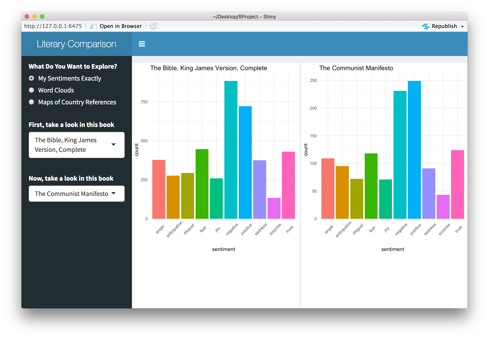
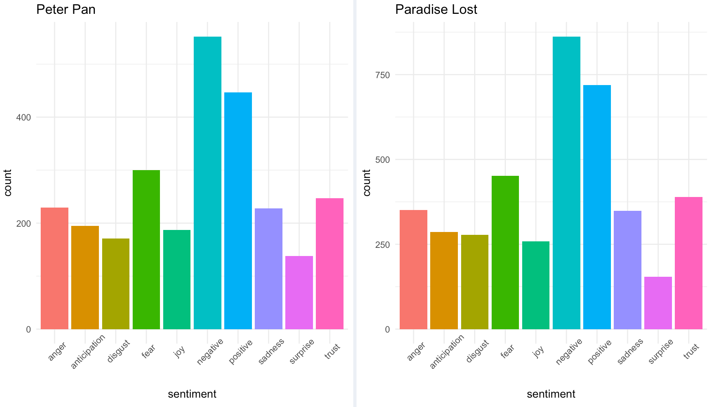
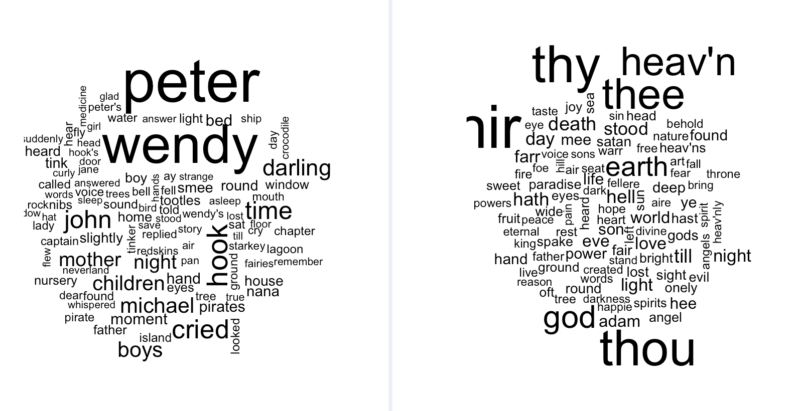
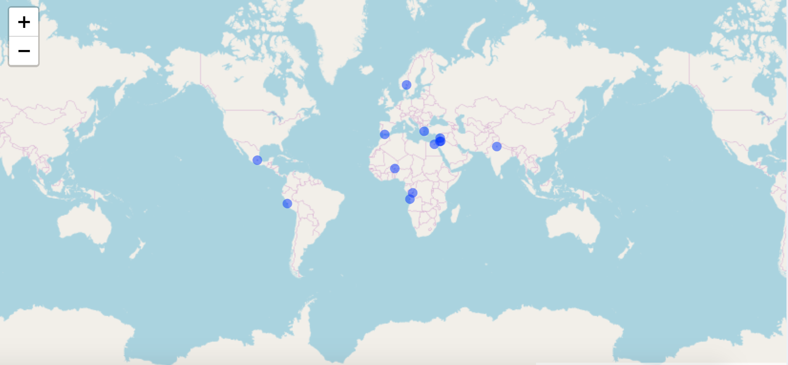

```{r setup with libraries, include=FALSE}
knitr::opts_chunk$set(echo = FALSE)


library(MAP)
library(forcats)
library(plyr)

library(ggplot2)
library(ggmosaic)
library(esquisse)
library(shiny)
library(shinydashboard)

library(readxl)
library(janitor)
library(magrittr)

library(maps)
library(maptools)
library(mapproj)
library(ggmap)

library(leaflet)
library(leaflet.extras)

library(wordcloud)

library(gutenbergr)
library(tidyverse)
library(tidytext)
library(imager)
```

```{r books to focus on, include = FALSE}
#### Books to Focus On ####
booksId = sort(c( 1232, 1129, 1122, 1120, 1118, 1112, 1004, 996, 981, 
                  832, 714, 514, 345, 341, 236, 228, 215, 203, 
                  175, 174, 164, 161, 150, 147, 141, 140, 135, 113, 
                  108, 103, 99, 98, 84, 77, 73, 61, 57, 46, 45, 
                  41, 35, 33, 30, 20, 16, 15))

numBooks = length(booksId)

miniMeta <- gutenberg_metadata %>% filter(gutenberg_id %in% booksId )

bookTitles <-as.vector(miniMeta$title)

bookData <- as.data.frame(cbind(booksId, bookTitles)) %>%  arrange(bookTitles)

bookTitles <- sort(bookTitles)

```

```{r country cleaning, include = FALSE}
#### Country Cleaning ####

data("world.cities") #data set with lists of cities and countries 

#set up the world data set to use for the latitudes and longitudes 
world <- world.cities %>% 
  rename(country = country.etc) %>% 
  filter(capital == 1)%>% select(-c(pop,capital))

world$country <- tolower(world$country)
world$country[world$country == "korea north"] <- "north korea"
world$country[world$country == "korea south"] <- "south korea"
world$country[world$country == "uk"] <- "united kingdom"
world$country[world$country == "usa"] <- "united states"

newGB <- c("london", "great britain", 	51.52, 	-0.10, 1)
newEngland <- c("london", "england", 	51.52, 	-0.10, 1)
newUS <- c("washington", "united states of america", 38.91, -77.02, 1)
newScotland <- c("edinburgh", "scotland", 55.95, -3.22, 0)
world <- rbind(world, newGB, newEngland, newUS,newScotland)

#list of countries 
countries <- unique(world$country)
#character, vector, not a data frame  

#gets the sentiment too 
snrc <- get_sentiments("nrc")

```

```{r paradise lost example, include = FALSE}
#GETS THE WORD FREQUENCIES 
bookName = "Paradise Lost" # name of book chosen 
gutNum <- bookData[which(bookData$bookTitles == bookName),1] #gutenberg id chosen book 
chosenBook <- gutenberg_download(gutNum) #gets book data - is a dataframe
chosenBook %<>%
  unnest_tokens(word, text) %>% #isolates each word into its own row 
  anti_join(stop_words) # gets rid of the stop words 
bkCount <-  chosenBook %>% count(word, sort = TRUE) #gets a word count 

#### sentiment analysis experimentation ####
snrc <- get_sentiments("nrc")
bkSent <- inner_join(bkCount,snrc) 
bkSent <- bkSent %>% group_by(sentiment) %>%
  summarise(freq = n()) %>% arrange(sentiment) %>%
  na.omit()
#View(bkSent)

plSent <- ggplot(bkSent) +
  aes(x = sentiment, fill = sentiment, weight = freq) +
  geom_bar() +
  scale_fill_hue() +
  theme_minimal() + 
  theme(axis.text.x = element_text(angle = 90))+ 
  ggtitle(bookName)+ theme(legend.position = "none")

#### word cloud experimentation ####
plCloud <- bkCount %>%
   with(wordcloud(word, n, max.words = 10))

wordfreaks <- bkCount[1:30, ]
colnames(wordfreaks) <- c("Word", "Frequency")

#GETS THE COUNTRIES 
bkCountries <- intersect(countries, bkCount$word)#list of countries in book
#isolates countries of interest from word frequency
bkCountryFreq <- bkCount %>% filter(word %in% bkCountries) %>%
  rename(country = word) #also renames words to country
#makes nices labels for the map
cName = c(bkCountryFreq[1:length(bkCountryFreq$n),1] )
cFreq = c(bkCountryFreq[1:length(bkCountryFreq$n),2] )
nameFreq <- paste0(bkCountryFreq$country, ":", bkCountryFreq$n, sep = " ")
bkCountryFreq <- cbind(bkCountryFreq, nameFreq)

#finds the countries of interest from main world data set
bkMini <- world %>% filter(country %in% bkCountries)
#combines info from world data set to the frequencies and labels
bkFull <- left_join(bkMini,bkCountryFreq)

#makes latitudes and longitudes doubles
bkFull$lat <- as.double(bkFull[,3])
bkFull$long <- as.double(bkFull[,4])

#create an interactive map 
# plMap <- leaflet(bkFull)%>%
#   setView(lng = 0, lat = 0, zoom = 1)%>%
#   addTiles()%>%
#   addCircles(data = bkFull, lat = ~lat, lng = ~long, weight = 8,
#              radius = 300, popup = ~as.character(nameFreq))
# typeof(plMap)
# plMap

```


## Challenge 

How do works of literature differ from an analytic standpoint? 

Is it possible to create an app for accessible quantitative literary analysis?

Focus on three areas:
    
    1) Sentiment  
    
    2) Word Frequency 
    
    3) Frequency of Mentioned Countries 

## Data 

Data was gathered from R libraries:

- **gutenbergr** for literary works 
- **maps** for *world.cities* data set 
- **leaflet** for maps 

## App Design 

1) Sentiment 
         
        - Utilized nrc schema to organize words into 10 emotion-base categories
        
        - For selected book, sentiment category of each word is matched
        
        - Overall frequency of each sentiment visualized 
        
2) Word Frequency 

        - Word cloud and table to visualize most frequent words 
        
3) Country Frequency 
    
        - Map locates countries mentioned in selected work 
        
        - Markers mention the country's frequency 


## App Design 

```{r, echo=FALSE, fig.align="center", fig.height=3, fig.width=4, out.width = "100%"}
   
```


## Example - Sentiments

```{r, echo=FALSE, fig.align="center", fig.height=3, fig.width=4, out.width = "100%"}
   
```

## Example - Word Cloud 

```{r, echo=FALSE, fig.align="center", fig.height=3, fig.width=4, out.width = "100%"}
   
```


## Example - Maps 

```{r, echo=FALSE, fig.align="center", fig.height=3, fig.width=4, out.width = "100%"}
   
```

## First Hand Account 

-Tested by creative writing and publishing student at Emerson College 

-Postive comments about how easy access to data that supports literary commentary 

-Allows more indepth understanding of inferences based on sentiments, word choices, and geographic patterns 

## Future Work 

-Add more works of literature as options 

-Expand sentiment analysis to other sentiment dictionaries 

-Perform frequency counts for cities 

-Include pages for certain references 


